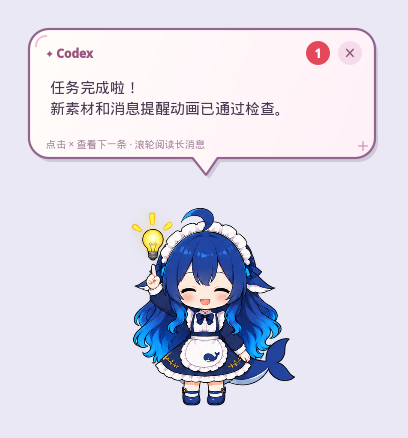

# 鲸鱼娘桌面宠物

使用 whalechan 重绘素材的原生 PyQt6 桌宠：透明背景、无边框、请求置顶、拖动、点击互动、右键切换动作、滚轮缩放、暂停动画，以及 agent 的 MCP 通知气泡与新消息提醒动画。运行时完全离线，不需要浏览器或原项目服务。

## 安装与运行

环境要求：

- Python 3.10 或更新（PyQt6 与 mcp 均要求 `>=3.10`；开发与验证使用 CPython 3.12 / 3.14）
- 图形桌面会话：Windows、macOS，或 Linux 的 X11 / XWayland（见「Linux 桌面」）
- 素材位于 `assets/`，默认加载 `assets/whalechan_sprites/pet.json`，运行本身不需要联网

```bash
git clone <本仓库地址> && cd desktop_companion

# 1. 创建虚拟环境（uv 与标准库 venv 二选一）
uv venv .venv
python3 -m venv .venv          # 不用 uv 时

# 2. 安装依赖
uv pip install --python .venv/bin/python -r requirements.txt
.venv/bin/python -m pip install -r requirements.txt   # 不用 uv 时

# 3. 确认 assets/whalechan_sprites/ 中的 pet.json 与 spritesheet.webp 完整
# 原始 PNG 更新后可重新生成运行图集，见「素材来源与许可 / 复现与校验」

# 4. 无桌面自检：12 条动画轨道、77 帧透明精灵、无边框窗口
.venv/bin/python pet.py --check

# 5. 运行
.venv/bin/python pet.py
```

Windows 把 `.venv/bin/python` 换成 `.venv\Scripts\python.exe`。

两个依赖文件的区别：`requirements.txt` 只列直接依赖及其允许区间，适合日常安装和升级；`requirements.lock.txt` 是开发机（CPython 3.14 / Linux x86_64）的完整锁定版本（含传递依赖），用于逐位复现当前环境。在其他平台或其他 Python 版本上若某个包没有可用 wheel，请改用 `requirements.txt`，或在本机重新生成锁定文件：`python -m pip freeze > requirements.lock.txt`。

### 系统依赖（Linux）

PyQt6 的 wheel 自带 Qt 运行时，但 xcb（X11 / XWayland）平台插件仍依赖系统的 Xcb、OpenGL、fontconfig 等库。桌面环境内一般已经装齐，最常缺的是 `libxcb-cursor`：

| 发行版 | 安装命令 |
| --- | --- |
| Debian / Ubuntu | `sudo apt install libxcb-cursor0 libxcb-icccm4 libxcb-image0 libxcb-keysyms1 libxcb-randr0 libxcb-render-util0 libxcb-shape0 libxcb-util1 libxcb-xfixes0 libxcb-xkb1 libxkbcommon-x11-0 libx11-xcb1 libegl1 libgl1 libfontconfig1 libdbus-1-3` |
| Fedora | `sudo dnf install xcb-util-cursor xcb-util-image xcb-util-keysyms xcb-util-renderutil xcb-util-wm libxkbcommon-x11 libX11-xcb mesa-libEGL mesa-libGL fontconfig dbus-libs` |

缺库时以自检命令为准（有输出表示还缺这些库）：

```bash
find .venv -name libqxcb.so -path "*platforms*" -exec ldd {} \; | grep "not found"
```

没有显示器的 CI 或 SSH 会话可以用 `QT_QPA_PLATFORM=offscreen` 运行 `--check` 和各检查脚本（`--check` 会自动使用该模式），但真正显示窗口仍需要一个桌面会话。

### 运行参数

```bash
.venv/bin/python pet.py                                  # 默认尺寸 240
.venv/bin/python pet.py --size 320                       # 窗口最长边像素数
.venv/bin/python pet.py --check                          # 离屏自检，不打开桌面窗口
.venv/bin/python pet.py --socket 名称                     # 指定本机通知 IPC 名称（默认按项目路径和用户生成）
.venv/bin/python pet.py --history-db /path/to/messages.sqlite3   # 指定历史数据库路径
```

左键拖动，单击播放互动动作，右键打开原生菜单，滚轮调整大小，通过菜单的“退出”退出。所有动作均为 `loop: false`，手动选择动作播放一轮后回到待机组；有未关闭的消息气泡时，动作结束后继续消息提醒。当前没有实现上游的养成数值、语音、自动 AI 对话和自动行走；agent 可以主动通过 MCP 发送通知。

启动时先播放漩涡素材的第 8、7、6、5、4、1 帧（按从左到右、从上到下的一基帧号），再招手一次。招手开始时弹出「解码中～返回显空间」，5 秒后自动消失。该提示使用独立气泡，不写入消息历史；启动期间收到的普通通知会保存，等启动提示消失后显示，继续遵循手动关闭规则。启动演出期间动作切换与暂停暂不可用，拖动和缩放仍可使用。

待机组在空闲时按权重随机选取一个动作，播放完整一轮后再抽取，允许连续抽中同一个动作。默认包含待机、向左/右行走、招手、跳跃、开心、思考和扣扣脑袋，排除低落、困倦和新消息提醒。默认“待机”的出现概率为 90%，其余已选动作平分剩下的 10%；增减组成员会自动重新分配默认权重。只有一个成员时概率为 100%，取消“待机”后其余成员默认等概率。概率按每次动作选择计算，动画时长不会改变抽取权重。

右键「设置 → 待机组表情」可勾选或取消任何动作，底部的「出现概率权重…」可调整各已选动作的相对权重，并实时查看归一化后的出现概率。权重为 0 的动作不会被抽中；「恢复默认」重新使用 90% / 10% 自动分配。组成员与自定义权重分别保存在项目 `data/settings.json` 的 `idleGroups`、`idleWeights` 字段，重启后继续使用，旧版只包含组成员的设置文件会自动使用默认权重。取消全部成员或全部权重设为 0 后显示静止的基础待机姿势。消息气泡全部关闭后恢复待机组；暂停动画仍可手动使用，新消息会恢复动画。专项检查：`.venv/bin/python scripts/check_animation.py`，使用临时设置与内存数据库。

桌宠设置为不接受键盘焦点、显示时不激活。移除了 Esc 退出，不注册全局热键；鼠标悬停或离开时均不主动接管其他应用的键盘输入。主动打开右键菜单时，保留标准菜单的临时键盘抓取，Esc 只关闭菜单；菜单关闭后释放抓取。

右键菜单的“历史消息”会列出最近 20 条通知的接收时间、标题与正文摘要。选择一条可查看完整消息，“查看 / 管理全部消息…”打开完整历史列表，支持加载更早消息、选择复制正文，以及重新显示气泡。历史窗口打开时，新收到的通知会出现在列表顶部，并保留正在阅读的消息。历史窗口由用户主动打开，可以使用键盘操作和复制文本。

历史列表中的复选框用于批量选择，“删除选中”会永久删除勾选的记录。“全选已显示”选择当前已加载的消息；可以加载更早消息后继续勾选，新收到的消息默认不勾选。“清空全部”确认后会删除数据库内全部历史，包括尚未加载的消息。删除会同步更新列表、条数、详情和下次打开的右键菜单；重启后也会保留删除结果。

所有成功接收的通知（包括排队中的消息）都会立即提交到 SQLite 数据库，默认路径为项目内的 `data/messages.sqlite3`。记录包含通知 ID、UTC 接收时间、标题、完整正文、显示时长及提示音设置；界面显示本地时间。退出或重启后历史仍保留，未显示完的通知不会自动弹出；从历史重新显示只生成气泡，不重复写入历史，也不播放提示音。队列已满或参数无效的请求不会存入历史；数据库写入失败时通知会返回错误。

数据库及其 WAL / SHM 辅助文件属于运行数据，默认 `data/` 已加入 `.gitignore`。数据库使用 Python 内置的 `sqlite3`，无需安装额外依赖。历史与菜单检查：`.venv/bin/python scripts/check_history.py`，使用临时数据库，不写入实际消息历史。

右键“退出”或关闭主窗口时，显示「正在返回潜空间」，按顺序播放漩涡素材的全部 8 帧（约 3.55 秒），完成后关闭宠物、气泡与 SQLite 数据库，停止动画计时器并结束 Qt 事件循环。退出演出开始时就关闭历史窗口、停止接受通知并释放本机 IPC，暂停状态会自动恢复以完成退出；重复退出不会重启动画。已经返回成功的通知均已提交到数据库；最终清理时取消尚未开始的存储任务，等待当前存储操作结束后关闭连接，未确认的请求不会在退出期间弹出气泡。主宠物窗口显式启用 `WA_QuitOnClose`，避免 Qt 默认将 `Tool` 窗口排除在最后窗口退出判断之外。Codex 启动的 stdio MCP 是由 MCP 客户端管理的独立进程，生命周期跟随客户端连接；桌宠退出后，相关工具会返回离线错误。

退出回归检查：`.venv/bin/python scripts/check_shutdown.py`；加 `--desktop` 可在真实桌面验证。检查会通过右键菜单点击“退出”，确认普通宠物、气泡显示中、历史窗口打开这三种情况的子进程正常结束并被回收，同时验证 IPC 文件与数据库锁已释放。

启动/退出专项检查：`.venv/bin/python scripts/check_lifecycle.py`，使用内存数据库与离屏窗口，验证默认大小、指定帧序、一次招手、5 秒提示、启动期间通知保留、退出帧序、暂停与重复关闭行为。

`--check` 使用 Qt 离屏平台检查鲸鱼娘（重绘版）的 12 条动画轨道、77 帧精灵、透明通道、动作 fallback，以及无边框窗口的透明绘制。离屏后端的 `does not support raise()` 提示是正常的。

## MCP：把桌宠当作 terminal bell

桌宠默认接收本机通知。先启动桌宠，再配置 MCP 客户端（已在运行的旧版本需要退出后重启）：

```bash
.venv/bin/python -m pip install -r requirements.txt
.venv/bin/python pet.py
```

将下面配置合并到支持 stdio 的 MCP 客户端配置中，重新连接 MCP server。项目内也提供了 `mcp-config.example.json`。两处路径都要换成本机的绝对路径：`command` 指向虚拟环境里的 Python（Windows 为 `.venv\Scripts\python.exe`），`args` 指向本项目的 `mcp_server.py`。

```json
{
  "mcpServers": {
    "desktop-pet": {
      "command": "/ABSOLUTE/PATH/TO/desktop_companion/.venv/bin/python",
      "args": ["/ABSOLUTE/PATH/TO/desktop_companion/mcp_server.py"]
    }
  }
}
```

MCP server 使用[官方 Python SDK](https://py.sdk.modelcontextprotocol.io/v1/) 的 stdio transport。客户端启动 `mcp_server.py`，通过本机 Qt local socket 将通知交给正在运行的 `pet.py`；不会额外启动一只宠物，不监听 HTTP 端口。默认 IPC 名称按项目路径和当前用户生成，Linux/Windows 设置为当前用户访问。支持多个 agent 连接同一只宠物。

| 工具 | 用途 |
| --- | --- |
| `desktop_pet_bell` | 在宠物旁显示动漫风格的对话气泡，返回通知 ID、`displayed` / `queued` 状态及等待条数 |
| `desktop_pet_status` | 检查桌宠是否运行、当前通知 ID、等待条数、当前动作与暂停状态；未运行时返回工具错误 |
| `desktop_pet_list_actions` | 查询当前宠物支持的动作名称、中文标签、循环属性和单轮时长 |
| `desktop_pet_play_action` | 立即播放指定动作，默认播放一次后回到待机；自动恢复暂停的动画 |

`desktop_pet_bell` 调用示例：

```json
{
  "message": "任务完成啦！\n测试全部通过，可以回来看看结果了。",
  "title": "Coding Agent",
  "sound": false
}
```

`message` 必填，支持 1–2000 字符的纯文本、中文、换行与 emoji。`title` 默认 `Agent`，最多 60 字符且为单行。有消息气泡未关闭时，持续播放 `notification`（新消息提醒）动画，每轮约 2.5 秒；这是消息状态驱动的重复播放，轨道本身仍为 `loop: false`。排队消息更新角标，关闭当前消息后显示下一条并继续提醒，最后一条关闭后恢复待机组。新消息会自动恢复暂停的动画。气泡一直显示到用户手动关闭；`duration_seconds` 仅为兼容旧调用保留，仍接受 3–120 秒，但不再控制自动关闭。默认安静显示；`sound: true` 同时请求系统提示音，是否有声音取决于桌面的 bell 设置。

agent 也可以先调用 `desktop_pet_list_actions`，再调用 `desktop_pet_play_action` 播放某个动作。例如让宠物招手一次：

```json
{
  "action": "waving",
  "once": true
}
```

当前鲸鱼娘支持 `idle`（待机）、`running-right`（向右行走）、`running-left`（向左行走）、`waving`（招手）、`jumping`（跳跃）、`failed`（低落）、`waiting`（开心）、`running`（困倦）、`review`（思考）、`notification`（新消息提醒）、`head-scratch`（扣扣脑袋）、`goodbye`（返回潜空间）。使用查询工具返回的名称作为 `action`，不要传中文标签。

`once` 默认 `true`，保留该参数兼容原有调用；设为 `false` 也只播放一轮。动作结束后，有消息气泡则继续提醒，否则随机播放待机组。`{"action": "idle"}` 播放一轮基础待机动作。动作立即替换当前动画、不排队，播放指令会恢复暂停的动画；向左 / 向右行走只播放动画，不移动窗口。未知动作返回错误并保留当前动作和暂停状态。动作工具与气泡工具可独立使用。

更新后重启桌宠并重新加载 MCP server，即可发现新增工具，原有连接配置可继续使用。

气泡使用奶白 / 粉色渐变、描边、阴影和指向角色的尾巴，保持置顶且不抢键盘焦点。移动或缩放宠物时气泡跟随，并在屏幕边缘调整位置。长消息可滚动阅读，气泡不会自动消失，只有点击 `×` 或右键菜单“收起通知 / 下一条”才关闭当前通知。有消息排队时，气泡标题旁显示红色计数角标，数字表示等待中的消息数（不含当前消息）；关闭当前消息后按先后顺序显示下一条，计数随之减少，没有排队消息时角标隐藏，关闭最后一条后气泡消失。最多等待 20 条；队列已满、文字无效或桌宠未运行时，工具明确返回错误。通知确认表示桌宠已接收，不表示用户已阅读。退出桌宠会清除未读队列。



可以在 agent 的指令中加入：

> 完成任务、需要我处理问题或等待我提供信息时，调用 desktop_pet_bell，用中文发送两三句简短通知。避免对每个操作都发送进度提示。

需要指定不同实例时，在桌宠和 MCP 配置的 `env` 中设置相同的 `DESKTOP_PET_SOCKET`，或为桌宠使用 `--socket 名称`。同一个 IPC 名称只运行一只宠物。

实例使用 `QLockFile` 持有与用户及 IPC 名称对应的进程间锁，锁文件放在系统临时目录。探测、清理残留 socket 和监听均在持锁期间进行；连接超时或权限错误不会触发端点删除。启动时也会检测尚未使用实例锁的旧版本桌宠。

桌宠监听成功后，会在系统临时目录的 `desktop-pet-discovery-<用户名哈希>/` 下原子写入一份端点发现记录，每个实例单独一个 JSON 文件，内容包含 Qt 的实际 socket 路径（Windows 为命名管道地址）和启动时间。目录和文件在 Unix 下仅当前用户可读写；正常退出只删除本实例的记录。客户端会先查询状态，忽略崩溃留下的离线记录。发现目录使用 Python `tempfile.gettempdir()` / Node `os.tmpdir()` 的临时目录设置；桌宠和客户端应使用相同的临时目录环境。

完整链路检查（不打开桌面窗口，包含真实 MCP 客户端握手、动作查询与播放、中文通知、排队角标、手动关闭、参数校验与 IPC 错误）：

```bash
.venv/bin/python scripts/check_notifications.py
.venv/bin/python scripts/check_notifications.py --preview /tmp/desktop-pet-preview.png
```

原生 Wayland 通常不允许客户端定位独立窗口，因此气泡跟随和贴边定位应使用支持窗口定位的桌面后端；GNOME 下默认使用下节说明的 XWayland。

### Pi：每轮对话结束自动 bell

`integrations/pi/desktop-pet-bell.ts` 是一个 Pi 扩展：在 Pi 完全停歇、等待输入时（`agent_settled` 事件）自动发一条气泡。事件驱动，不依赖模型自觉调用工具；中断（`⏹ Pi 已停止`）和出错（`⚠️ Pi 运行出错`）用不同文案，默认通知完成和错误，取消默认不通知。

气泡正文默认是**模型写的一两句总结**，而不是固定文案。扩展保存 `agent_before_settle` 给出的上下文快照 `context.llmMessages`，连同当轮模型、思考级别与 session id，在末尾追加一条「请用一两句总结你刚才的回复」的请求，再调用一次 `modelRegistry.complete()`。快照自带 leading system message 时直接沿用；否则补上当轮的 system prompt 和工具声明。这样尽量复用缓存前缀，实际命中仍取决于 provider 的渲染、历史思考保留策略和服务端缓存状态。返回的总结只用来填气泡，不写回会话、不进 transcript、下一轮看不到。

Pi 扩展的事件回调无法调用 MCP 工具（MCP 工具只对模型 / codemode 开放），因此 bell 直接写桌宠的 Qt local socket，与 `mcp_server.py` 使用同一端点、同一套参数校验，不会额外启动宠物。

```bash
# 安装（软链，改完源码后 /reload 或重启 pi 生效）
ln -sfn "$PWD/integrations/pi/desktop-pet-bell.ts" ~/.pi/agent/extensions/desktop-pet-bell.ts
```

端点按以下顺序解析：`DESKTOP_PET_SOCKET`（名称或绝对路径）→ 配置里的 `socket` → `DESKTOP_PET_DIR` 或配置的 `projectDir` → 系统临时目录中的端点发现记录（选择最近启动且在线的实例）→ 从 `~/.pi/agent/mcp.json`、`<cwd>/.pi/mcp.json` 中找到启动 `mcp_server.py` 的那个 server 并取其所在目录 → 当前目录存在 `pet_ipc.py` 时用当前目录 → 从扩展文件的真实位置找到所属仓库（支持上述软链接安装）。因此软链接安装和直接复制扩展都可以自动发现桌宠，不依赖 Pi 的启动目录。发现记录也支持桌宠通过 `--socket` 指定的自定义端点；若同时运行多只桌宠，指定 `socket` 可固定目标实例。目录推导仍按 `pet_ipc.default_server_name()` 的真实路径 + 当前用户名换算哈希，无需手填哈希。

首次启用临时目录发现时，需重启桌宠以生成记录，并在 Pi 中 `/reload`；复制安装的扩展还需重新复制更新后的文件。扩展不会自行启动桌宠。

可选配置文件 `~/.pi/agent/desktop-pet.json`（项目内 `.pi/desktop-pet.json` 优先）：

```json
{
  "projectDir": "/ABSOLUTE/PATH/TO/desktop_companion",
  "event": "agent_settled",
  "title": "Pi",
  "sound": false,
  "ringOnError": true,
  "ringOnAbort": false,
  "debounceMs": 1500,
  "warn": true,
  "summary": {
    "enabled": true,
    "maxChars": 90,
    "maxTokens": 512,
    "temperature": 0.2,
    "timeoutMs": 15000,
    "minInputChars": 60,
    "noThinking": false
  }
}
```

`event` 可设为 `turn_end`（每个回合触发，包括工具循环之间的回合；不再额外响应 `agent_settled`）或 `off`；`title` 默认取 Pi 的会话名；`debounceMs` 抑制短时间内的重复通知；`warn` 在桌宠未运行等失败时于 Pi 内提示一次，之后保持安静。`ringOnError: false` 只关闭错误通知，正常完成仍会通知。总结相关：`minInputChars` 以下的短回复直接用固定文案（不花 token），`maxChars` 限制气泡长度，`timeoutMs` 之后放弃总结退回固定文案，`prompt` 可覆盖注入的指令。总结请求不计入 Pi 会话内的 token / 费用统计，也不会出现在 transcript 里，但仍消耗模型 token，远端 provider 仍可能收费。

在思考模型上，思考 token 和正文共用 `maxTokens`：总结那一次如果思考过长就会吃满预算、返回空正文，于是退回固定文案。默认沿用会话的思考级别（会话关闭思考时也保持关闭），通过摘要指令请求简短输出，默认 `maxTokens` 为 512；可以用配置覆盖。这个上限控制生成预算，不改变输入消息。

`noThinking: true` 会停止沿用会话的思考级别，并在 OpenAI 兼容请求中合并 `reasoning_effort: "none"`。`samplingParams` 的其他字段会保留，若同时指定 `reasoning_effort`，则 `noThinking` 优先。关闭思考可能改变 chat template 的 system 指令和生成后缀，降低缓存复用率，所以默认关闭此选项。当前 `gufo` 支持多个缓存检查点，但改变 system 前缀仍可能导致缓存失效；它不保证执行 reasoning-token budget。`samplingParams` 仅对 OpenAI 兼容适配器生效，具体参数支持取决于 provider。

用户主动取消不会发错误气泡：`outcome` 为 `aborted`、abort signal 已触发、或最后一条回复的 `stopReason` 为 `aborted` 时，都按取消处理（取消时被掩断的流和退出中的进程常常上报成 `error`）。想连取消一起通知就设 `"ringOnAbort": true`。

会话内可用 `/pet-bell on|off|status` 开关与查看解析到的端点（status 会显示上次总结的 `cache 读 / 写 / 新 / 出` token），`/pet-bell plain` 临时切换固定文案，`/pet-bell 文本` 发送一条测试气泡；启动时用 `pi --no-pet-bell` 关闭 bell、`pi --pet-bell-plain` 只要固定文案不要总结。TUI 下总结在后台跑，不阻塞输入；关闭 bell、切换摘要模式、开始新一轮对话、切换会话或退出时，会取消待发摘要并丢弃迟到的结果。新通知也会取代尚未完成的旧通知。`pi -p` 一次性调用会等总结完成或超时后再退出。设 `DESKTOP_PET_BELL_DEBUG=/path/to/log` 可把每次总结的 cache 命中与发送文本追加到日志，用于确认 KV 复用。

安装 Pi 后可运行 `node scripts/check_pi_bell.mjs` 做回归检查。检查使用 mock 模型和 IPC，并在 Pi 原生 Qwen 适配器发送请求前检查参数，不访问模型服务，也不向真实桌宠发通知。

`.venv/bin/python scripts/check_ipc_discovery.py` 检查发现记录的发布、权限、实例冲突、重启和退出清理，并让 Node 扩展通过真实 Qt socket 发送通知；所有端点和记录都隔离在测试实例中，不通知真实桌宠。

## Linux 桌面

GNOME + Wayland 且存在 DISPLAY 时，默认使用 XWayland（Qt xcb），让 GNOME 实际处理 `_NET_WM_STATE_ABOVE`，保持桌宠在普通应用窗口之上。保留用户显式设置的 `QT_QPA_PLATFORM`。其他 Wayland 桌面仍使用 Qt 的系统拖动和窗口管理器支持的置顶行为。不能承诺覆盖其他置顶窗口、全屏应用或系统界面。

手动选择 XWayland：

```bash
QT_QPA_PLATFORM=xcb .venv/bin/python pet.py
```

此模式需要系统安装 XWayland 以及 Qt xcb 平台插件的运行库（见「系统依赖（Linux）」）。若发行版没有提供 `libxcb-cursor.so.0`，可以把该库文件放到项目根的 `.native/usr/lib64/`：程序只在 xcb 模式下预加载它，不修改系统安装，`.native/` 已列入 `.gitignore`。这只是兵底方案，优先用包管理器安装。

真实桌面回归检查：`.venv/bin/python scripts/check_window_behavior.py`，会短暂打开测试窗口，验证普通窗口反复激活时的层级、不接收焦点属性、原始右键菜单与 Esc 关闭行为。

窗口透明区域目前仍属于窗口输入区域，没有实现按角色轮廓点击穿透。

## 代码结构与开发检查

`pet.py` 中的 `create_pet()` 负责装配各组件，`DesktopPet` 负责绘制、鼠标操作和窗口展示。业务模块通过显式依赖与 Qt 信号连接。

| 模块 | 职责 |
| --- | --- |
| `contracts.py` | 通知与历史数据类型、MCP 返回类型、共享参数校验和容量规则 |
| `history_store.py` / `history_service.py` | 独立 SQLite 仓库、专用存储线程及主线程结果交付 |
| `notification_controller.py` | 持久化后确认、容量预留、FIFO 队列和静默历史重放 |
| `pet_assets.py` / `animation.py` | 素材加载校验、实例帧缓存和动画播放状态 |
| `pet_settings.py` | 待机组选择和出现权重的读取与原子保存 |
| `idle_weights.py` / `idle_weights_dialog.py` | 待机组默认权重、数值校验及权重调整界面 |
| `pet_commands.py` / `pet_ipc.py` | 应用命令分发、本机 socket 协议和实例锁 |
| `message_history.py` / `speech_bubble.py` | 异步历史管理界面和通知气泡 |

SQLite 连接在存储线程中创建、使用和关闭；运行中的查询、提交和删除不会阻塞 Qt 事件循环。通知写入与历史重放查询在完成前就预留容量，写入失败会释放预留；异步完成后仍按接收顺序显示。右键菜单使用已提交历史的最近消息缓存。

内部的 `HistoryService` 存储方法、`NotificationController.notify()` 和 `replay()` 返回 `concurrent.futures.Future`；结果回调在 Qt 主线程执行。界面使用完成回调，不能在 Qt 主线程上等待尚未完成的 `Future.result()`。启动前的数据库初始化和退出时的连接关闭会等待存储线程。MCP 工具名称、参数、返回 JSON 和 SQLite 表结构保持兼容，无需迁移现有历史数据库。

素材加载时检查动作、idle / fallback、待机组、帧数、正整数时长、精灵图裁切范围及所有分帧图片。`sprite2d` 默认采用上游九行布局，也支持用 `actions` 指定行序；清单可用 `labels` 指定动作的中文名称、用 `idleGroup` 指定默认待机组。帧缓存属于每个素材实例，最多保存 100 帧。

重构专项检查使用临时数据库、随机 IPC 名称与离屏窗口，验证并发启动、残留端点、数据库锁定时的界面响应、未完成写入的容量预留、FIFO、重放和无效素材：

```bash
.venv/bin/python scripts/check_refactor.py
```

现有 `check_history.py`、`check_notifications.py`、`check_shutdown.py` 和 `check_window_behavior.py` 保留各自的端到端检查；`check_support.py` 提供仅用于检查脚本的 Qt 事件循环等待工具。

## 素材来源与许可

### 来源

当前默认素材为 `assets/whalechan_sprites/` 中的 12 张 whalechan 重绘动作 PNG，使用原「鲸鱼娘（精致版）」及重绘待机图作参考；原 10 组动作的生成说明保存在该目录的 `generation_prompts.md`。「扣扣脑袋」使用 `Whalechan’s puzzled head-scratch animation.png`，启动/退出演出使用 `Whalechan’s Goodbye into a Cosmic Vortex.png`。运行图集为统一 560×560 单元格、8 列 × 12 行的 `spritesheet.webp`，共 77 帧，按角色锚点对齐，并保留跳跃腾空和漩涡缩小过程。漩涡轨道默认属于启动/退出演出，待机组原有默认成员与 90% / 10% 权重保持不变。原始 PNG 保留不变。

原 dsh-web「鲸鱼娘（精致版）」图集仍保存在 `assets/whale-refined/`，作为重绘参考和兼容性检查素材，其来源为：

- 上游仓库：[zhu1090093659/dsh-web](https://github.com/zhu1090093659/dsh-web)（`packages/dsh-pet`，npm 包名 `@linxin666/dsh-pet`）
- 上游目录：[packages/dsh-pet/assets/whale-refined](https://github.com/zhu1090093659/dsh-web/tree/bd6c2bb67d9f88e1190c6884982c03c88205aa39/packages/dsh-pet/assets/whale-refined)
- 固定版本：`bd6c2bb67d9f88e1190c6884982c03c88205aa39`（下载、哈希校验和归因都锁定该 commit，不跟随 `main`）

原图为 1536×1872 的 8 列 × 9 行图集（单元格 192×208，使用 alpha），行序为 idle / running-right / running-left / waving / jumping / failed / waiting / running / review。重绘版保留这些 MCP 动作名称，并增加 `notification`；其中 `waiting` 对应开心，`running` 对应困倦。

上游记录的衍生关系（摘自 `packages/dsh-pet/README.zh.md` 的内置宠物表与来源说明）：

| 层级 | 内容 |
|---|---|
| 鲸鱼娘（原版）`whale` | dsh-web 仓库原有的鲸鱼娘图集，其 `pet.json` 标注 `license: BSD-3-Clause` |
| 鲸鱼娘（精致版）`whale-refined` | 本项目重绘素材的参考图：以上述设计方向为基础，经 AI 辅助二次创作、修复与细节精修的衍生版本，`pet.json` 标注 `license: MIT` |
| 更早的灵感来源 | 上游说明精致版参考了 DreamSkin 的「DeepSeek-鲸鱼娘」主题（[dreamskin.cc](https://dreamskin.cc)，历史来源记录标注作者 `powerdog996`、主题 MIT，见 [dsh-web commit `87edd7f`](https://github.com/zhu1090093659/dsh-web/commit/87edd7ff4800dffd40bc93fb76e4ae450390facd)）。该记录只用于说明来源与衍生关系，精致版并非原作者的官方作品 |

### 许可声明现状（上游不一致，本项目按最严格口径处理）

上游对这批素材的授权声明并不统一：

| 位置 | 声明 |
|---|---|
| dsh-web 根 `LICENSE`、`packages/dsh-pet/LICENSE` | Apache License 2.0。两份内容完全相同，是未填写版权人的 Apache-2.0 原文，在本仓库分别保存为 `assets/UPSTREAM-LICENSE` 与 `assets/DSH-PET-LICENSE` |
| `packages/dsh-pet/package.json` | `"license": "Apache-2.0"` |
| `assets/whale-refined/pet.json` | `"license": "MIT"`，且**没有 `author` 字段**（上游其他宠物通常会声明作者，例如 `ouo-neko` → `Pessimist0906`、`jyn` → `11726`） |
| 上游 `packages/dsh-pet/THIRD_PARTY_NOTICES.md` | 逐项声明了喷水鲸鱼装饰（派生自 DeepSeek wordmark，MIT © 2026 DeepSeek）、`ouo-neko`（MIT © Pessimist0906）、Miku（MIT © stushansusu，另受 Piapro 角色许可约束）等，但**未包含 `whale-refined`** |

结论：精致版素材同时被上游标为 Apache-2.0（仓库 / 包级）与 MIT（清单级），且缺少可署名的版权人。在作者本人澄清之前，本项目按约束更强的 **Apache-2.0** 对待这批素材：保留两份许可证原文、保留 `pet.json` 原样（不修改、不覆盖其 `license` 字段）、保留 `assets/source.json` 的来源与哈希记录，并在再分发时一并附上本节链接。Apache-2.0 相比 MIT 额外要求保留专利条款并标注修改，因此再分发或做衍生时请连同本文件与整个 `assets/` 一起附带，不要只取走 `spritesheet.webp`。

本项目自身的代码（`*.py`、`scripts/`、`docs/`）与素材许可相互独立；仓库当前没有声明自身许可证，若计划开源请自行选择并补充根 `LICENSE`，同时不要把素材的 Apache-2.0 约束误当作代码的许可结论。

补充提醒：上游 `packages/dsh-pet/assets/` 下还有其它宠物，其中星夜人偶（Starry Doll）为 CC-BY-NC-SA-4.0、Miku 受 Piapro 角色许可约束。本项目未使用这些素材；若以后扩展宠物，需要逐个核对清单与 `THIRD_PARTY_NOTICES.md`，不能沿用本节的结论。

### 复现与校验

重绘 PNG 更新后，可用准备脚本重新切帧、对齐并生成运行图集与清单。Pillow 仅用于美术准备，运行桌宠不需要它：

```bash
python3 -m pip install Pillow
python3 scripts/prepare_whalechan_assets.py
.venv/bin/python pet.py --check
```

以下下载脚本用于恢复原始参考素材，不会生成或覆盖重绘版：

```bash
python3 scripts/fetch_assets.py
```

脚本通过 GitHub API 读取固定 revision 的 tree，只抓取 `whale-refined` 目录与两份 `LICENSE`，按 Git blob SHA-1 校验后写入 `assets/`。`assets/source.json` 记录 5 个上游文件的路径、大小和 blob SHA-1；已完整的文件会被跳过，失败后可以直接重跑。更换素材版本时，需要同步更新 `scripts/fetch_assets.py` 里的 `REVISION`、`assets/source.json` 和本节的固定版本号。

若要把上游的第三方声明一并归档，可在 `fetch_assets.py` 的白名单中加入 `packages/dsh-pet/THIRD_PARTY_NOTICES.md`（当前未抓取）。
